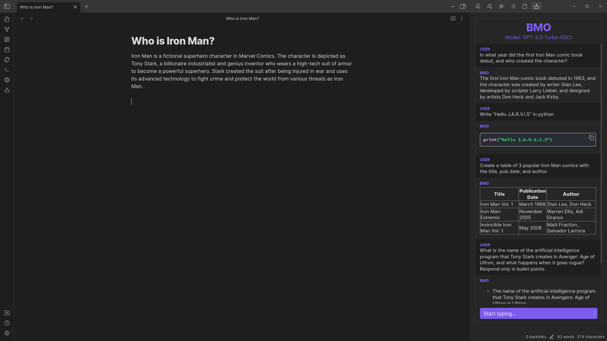
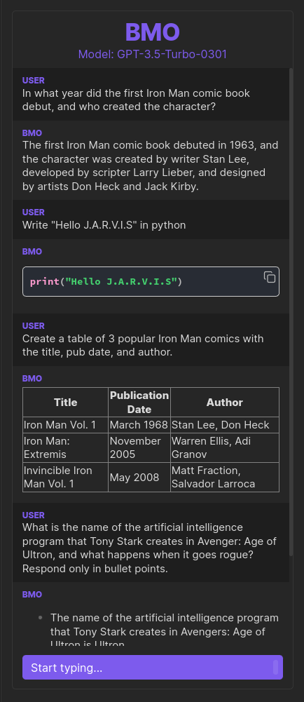

# BMO Chatbot for Obsidian
Improve your knowledge management with a chatbot that understands context and retrieves relevant information using Large Language Models (LLMs) such as OpenAI's "gpt-3.5-turbo" and "gpt-4" for Obsidian.

  

## How to activate the plugin
Three methods:

(**Recommended**) Beta Reviewers Auto-update Tester ([BRAT](https://github.com/TfTHacker/obsidian42-brat)) - [Quick guide for using BRAT](https://tfthacker.com/Obsidian+Plugins+by+TfTHacker/BRAT+-+Beta+Reviewer's+Auto-update+Tool/Quick+guide+for+using+BRAT)

1. Search for "Obsidian42 - BRAT" in the Obsidian Community plugins.
2. Open the command palette and run the command BRAT: Add a beta plugin for testing (If you want the plugin version to be frozen, use the command BRAT: Add a beta plugin with frozen version based on a release tag.)
3. Paste "https://github.com/longy2k/obsidian-bmo-chatbot" into the modal.
4. Click on "Add Plugin"
5. After BRAT confirms the installation, in Settings go to the Community plugins tab.
6. Refresh the list of plugins
7. Find the beta plugin you just installed and Enable it.

Obsidian Community plugins (currently in review):
  1. Search for "BMO Chatbot" in the Obsidian Community plugins.
  2. Enable "BMO Chatbot" in the settings.

To activate the plugin from this repo, please follow these steps:
  1. Navigate to the plugin's folder in your terminal.
  2. Run `npm install` to install any necessary dependencies for the plugin.
  3. Once the dependencies have been installed, run `npm run build` to build the plugin.
  4. Once the plugin has been built, it should be ready to activate.

## Requirements

To use this plugin, you need an OpenAI account with API access. If you don't have an account yet, you can sign up for one on the [OpenAI website](https://platform.openai.com/overview). Please note that access to GPT-4 is only available if you have been granted access by OpenAI.

## Getting Started

To start using the plugin, enable it in your settings menu and enter your OpenAPI key. After completing these steps, you can access the bot panel by clicking on the bot icon in the left sidebar.

If you want to clear the chat history, simply click on the bot icon again in the left ribbon bar.

## Features
- **Chat from anywhere in Obsidian:** Chat with your bot wherever you are!
- **Chatbot responds in Markdown:** Receive formatted responses in Markdown for consistency.
- **Customizable bot name:** Personalize the chatbot's name.
- **System role prompt:** Configure the chatbot to prompt for user roles before responding to messages.
- **Set Max Tokens and Temperature:** Customize the length and randomness of the chatbot's responses with Max Tokens and Temperature settings.
- **System theme color accents:** Seamlessly matches the chatbot's interface with your system's color scheme.

## Other Notes
"BMO" is a tag name for this project, inspired by the character BMO from the animated TV show Adventure Time.

## Contributing
Feel free to improve the plugin!
If you have any improvements, questions, or concerns, just let me know!
