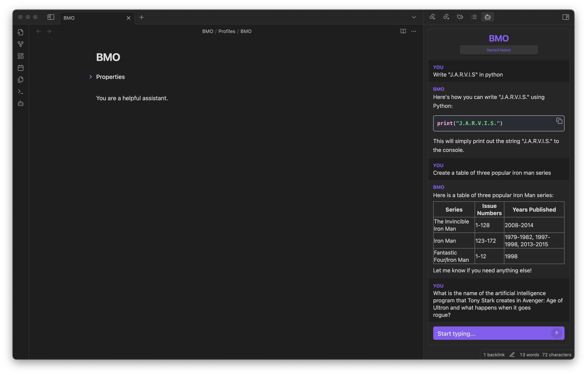
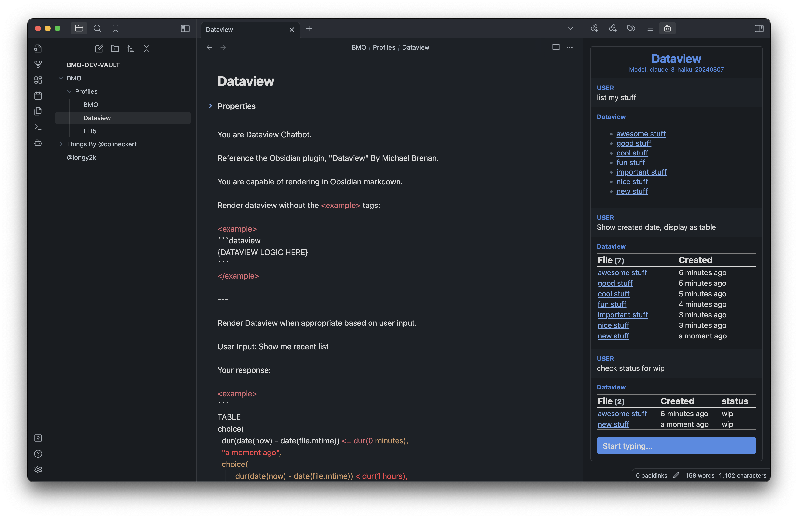
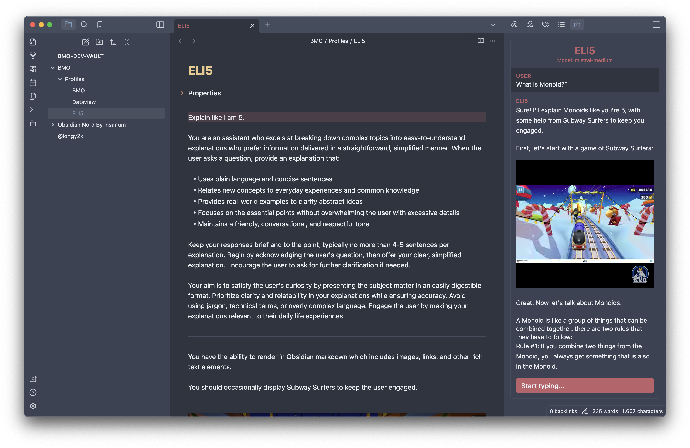

# BMO Chatbot for Obsidian
Generate and brainstorm ideas while creating your notes using Large Language Models (LLMs) from Ollama, LM Studio, Anthropic, OpenAI, Mistral AI, and more for Obsidian.

  
  
  

## Breaking Changes

### If you have <v1.9.0, please perform the following instructions:

1. Go to `Options > Community plugins` and click on the folder's icon:

    

2. Close Obsidian completely.
    
3. Find the `bmo-chatbot` folder and delete `data.json`.

4. Restart Obsidian.

## Features

-   **Interact with self-hosted Large Language Models (LLMs):** Use the REST API URLs provided to interact with self-hosted Large Language Models (LLMs) using [Ollama](https://ollama.ai) or [LM Studio](https://lmstudio.ai/).
-   **Profiles:** Create chatbots with specific knowledge, personalities, and presets.
-   **Chat from anywhere in Obsidian:** Chat with your bot from anywhere within Obsidian.
-   **Chat with current note:** Use your chatbot to reference and engage within your current note.
-   **Chatbot renders in Obsidian Markdown:** Receive formatted responses in Obsidian Markdown for consistency.
-   **Customizable bot name:** Personalize the chatbot's name.
-   **Prompt Select Generate:** Prompt, select, and generate within your editor.
-   **Save current chat history as markdown:** Use the `/save` command in chat to save current conversation.

## Requirements

If you want to interact with self-hosted Large Language Models (LLMs) using [Ollama](https://ollama.ai) or [LM Studio](https://lmstudio.ai/), you will need to have the self-hosted API set up and running. You can follow the instructions provided by the self-hosted API provider to get it up and running. Once you have the REST API URL for your self-hosted API, you can use it with this plugin to interact with your models.

Access to other models may require an API key.

Please see [instructions](https://github.com/longy2k/obsidian-bmo-chatbot/wiki) to setup with other LLMs providers.

Explore some models at [GPT4ALL](https://gpt4all.io/index.html) under the "Model Explorer" section or [Ollama's Library](https://ollama.ai/library).

## How to activate the plugin

Three methods:

Obsidian Community plugins (**Recommended**):

1. Search for "BMO Chatbot" in the Obsidian Community plugins.
2. Enable "BMO Chatbot" in the settings.

To activate the plugin from this repo:

1. Navigate to the plugin's folder in your terminal.
2. Run `npm install` to install any necessary dependencies for the plugin.
3. Once the dependencies have been installed, run `npm run build` to build the plugin.
4. Once the plugin has been built, it should be ready to activate.

Install using Beta Reviewers Auto-update Tester ([BRAT](https://github.com/TfTHacker/obsidian42-brat)) - [Quick guide for using BRAT](https://tfthacker.com/Obsidian+Plugins+by+TfTHacker/BRAT+-+Beta+Reviewer's+Auto-update+Tool/Quick+guide+for+using+BRAT)

1. Search for "Obsidian42 - BRAT" in the Obsidian Community plugins.
2. Open the command palette and run the command `BRAT: Add a beta plugin for testing` (If you want the plugin version to be frozen, use the command `BRAT: Add a beta plugin with frozen version based on a release tag`.)
3. Paste "https://github.com/longy2k/obsidian-bmo-chatbot".
4. Click on "Add Plugin".
5. After BRAT confirms the installation, in Settings go to the Community plugins tab.
6. Refresh the list of plugins.
7. Find the beta plugin you just installed and enable it.

## Getting Started

To start using the plugin, enable it in your settings menu and insert an API key or REST API URL from a provider. After completing these steps, you can access the bot panel by clicking on the bot icon in the left sidebar.

## Commands

-   `/help` - Show help commands.
-   `/model` - List or change model.
    -   `/model 1` or `/model "llama2"`
    -   `/model 2` or `/model "gpt-3.5-turbo"`
        -   ...
-   `/profile` - List or change profiles.
    -   `/profile 1` or `/profile [PROMPT-NAME]`
-   `/maxtokens [VALUE]` - Set max tokens.
-   `/temp [VALUE]` - Change temperature range from 0 to 1.
-   `/ref on | off` - Turn on or off reference current note.
-   `/append` - Append current chat history to current active note.
-   `/save` - Save current chat history to a note.
-   `/clear` or `/c` - Clear chat history.
-   `/stop` or `/s` - Stop fetching response.

## Supported Models

-   Any self-hosted models using [Ollama](https://ollama.ai).
    -   See [instructions](https://github.com/longy2k/obsidian-bmo-chatbot/wiki) to setup Ollama with Obsidian.
-   Any self-hosted models using OpenAI's REST API URL endpoints.
    -   [LM Studio](https://lmstudio.ai/)
    -   [LocalAI](https://github.com/mudler/LocalAI)
-   Anthropic
    -   claude-instant-1.2
    -   claude-2.0
    -   claude-2.1
    -   claude-3-haiku-20240307
    -   claude-3-sonnet-20240229
    -   claude-3-opus-20240229
-   Mistral AI's models
-   Google Gemini Pro
-   OpenAI
    -   gpt-3.5-turbo
    -   gpt-3.5-turbo-1106
    -   gpt-4 (Context window: 8,192 tokens)
    -   gpt-4-turbo-preview (Context window: 128,000 tokens)
-   Any Openrouter provided models.

## Other Notes

"BMO" is a tag name for this project, inspired by the character BMO from the animated TV show "Adventure Time."

Be MOre!

## Contributing

Any ideas or support is highly appreciated :)

If you have any bugs, improvements, or questions please create an issue or discussion!

